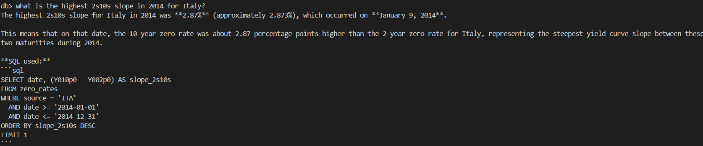
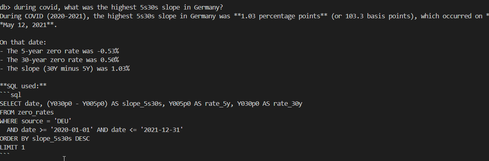
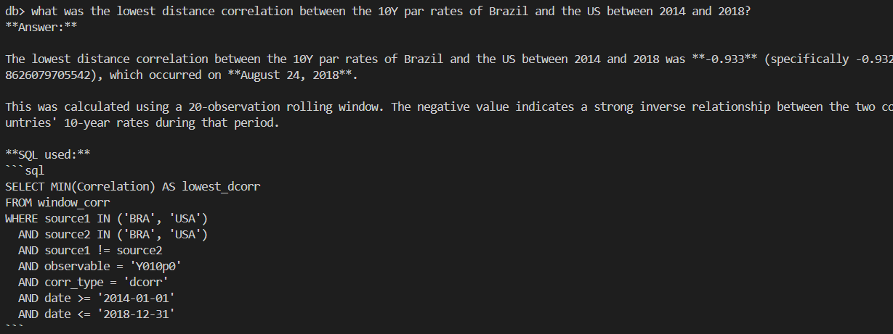
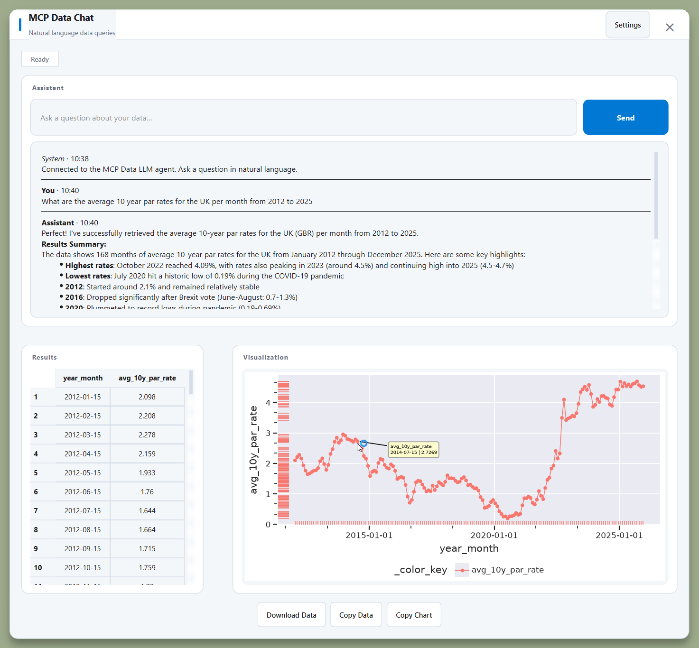
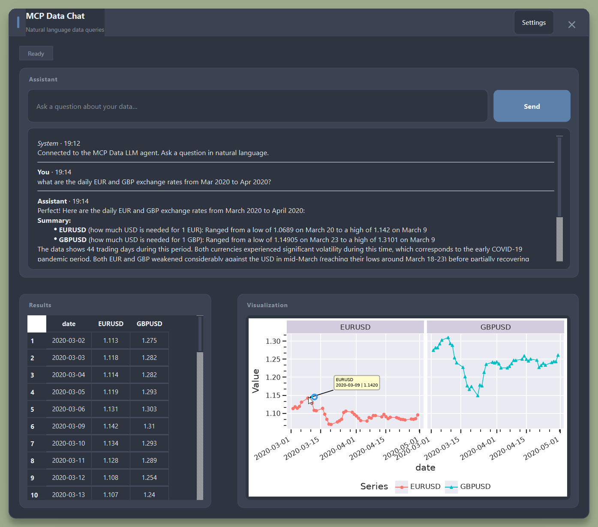

# mcp-data

A **Model Context Protocol (MCP) server and client** for querying databases with natural
language. Ask questions about your data in plain English and get SQL-backed answers.

## Quick example

Query your database using free-form natural language with the agentic LLM mode:

```bash
uv run db-mcp-client --llm "highest 5Y–10Y zero rate spread for Italy between 2010 and 2015?"
uv run db-mcp-client --llm "during covid, what was the highest 5s30s slope in Germany?"
```

The agent introspects your schema, builds the SQL, runs it, observes the results, and
self-corrects if needed — all while understanding domain vocabulary like country names
and financial terminology from a per-dataset semantic profile.

### Sample queries and results

<div align="center">
  <table>
    <tr>
      <td></td>
      <td></td>
      <td></td>
    </tr>
  </table>
</div>

---

## Overview

A **Model Context Protocol (MCP) server and client** for querying databases with natural
language. Choose between **SQLite** and **DuckDB** backends via `MCP_DB_TYPE`, both hidden
behind a generic `DataBackend` abstraction so the storage layer can be swapped without
touching the server tools or client. Transport defaults to **stdio**; **Streamable HTTP**
(hosted via FastAPI) is available by setting `MCP_TRANSPORT=http`.

Key libraries:

| Concern | Library |
| --- | --- |
| Package / dependency management | **uv** |
| DataFrames | **polars** |
| Query pipeline | **Apache Hamilton** |
| SQLite backend | **sqlite3** (standard library) |
| DuckDB backend | **duckdb** |
| MCP server | **FastMCP** (official `mcp` SDK) + **FastAPI** for HTTP |
| LLM integration | **LangChain** + **langchain-anthropic** (Claude) |
| Agentic loop | **LangGraph** (`create_react_agent`) |
| MCP ↔ LangChain bridge | **langchain-mcp-adapters** |
| Desktop GUI (optional) | **PySide6** + **matplotlib** (`uv sync --group gui`) |

## Architecture

```
user query
    │
    ├── RuleBasedPlanner  (keyword syntax, no API key)
    ├── LLMPlanner        (single-shot, --llm-single-shot)
    └── SQLAgent          (ReAct loop, --llm)
            │
            ▼
    MCP ClientSession ─── stdio or Streamable HTTP ───► FastMCP server
                                                              │
                                          tools: list_tables, get_schema,
                                                 run_sql, describe_dataset
                                                              │
                                          Hamilton dataflow (validate →
                                          execute → polars frame → JSON)
                                                              │
                                          DataBackend (SQLiteSource or DuckDBSource)
                                          with read_only protection
                                                              │
                                          semantics/<dataset>.yaml
                                          (served via describe_dataset)
```

A per-dataset **semantic layer** (see [Semantic layer](#semantic-layer)) is co-located
with the database and exposed by the MCP server. Both LLM modes fetch it on startup so
they understand domain vocabulary (e.g. "Italy" → `ITA`, "5Y" → `Y005p0`) before
generating SQL.

## Module layout (`src/mcp_data/`)

| Module | Responsibility |
| --- | --- |
| `config.py` | `Settings` dataclass; loads all config from env / `.env` |
| `backends/base.py` | `DataBackend` (read) + `DataSink` (write) contracts; `is_read_only_sql` guard |
| `backends/sqlite_backend.py` | `SQLiteSource`: unified read/write SQLite store (`read_only` flag) |
| `backends/duckdb_backend.py` | `DuckDBSource`: unified read/write DuckDB store (`read_only` flag) |
| `backends/__init__.py` | `create_backend()` factory; selects SQLite or DuckDB based on `MCP_DB_TYPE` |
| `semantics/__init__.py` | `SemanticProfile`, `load_profile`, `render_profile_prompt` |
| `data/seed.py` | Creates and seeds the example SQLite database |
| `data/download_ycs.py` | Downloads raw yield-curve data from external sources |
| `data/populate_ycs.py` | Parses and loads yield-curve data into SQLite |
| `pipeline/dataflow.py` | Hamilton nodes: validate → execute → frame → serialize |
| `pipeline/runner.py` | Builds the Hamilton driver and calls the dataflow |
| `server/app.py` | MCP tools + resources + FastAPI HTTP host |
| `server/__main__.py` | Entry point; dispatches on `MCP_TRANSPORT` |
| `client/session.py` | `DBClient`: transport-agnostic MCP session (stdio + HTTP) |
| `client/planner.py` | `RuleBasedPlanner` + `LLMPlanner` (single-shot Claude) |
| `client/agent.py` | `SQLAgent`: LangGraph ReAct agent over live MCP tools |
| `client/cli.py` | CLI entry point (`db-mcp-client`; supports `--gui`) |
| `gui/` | Desktop GUI (PySide6): chat, table, plotnine charts over `SQLAgent` |

Semantic profiles live under `semantics/` at the project root:
`semantics/input_data.yaml` (real yield-curve dataset) and `semantics/example.yaml`
(seeded demo database).

## Database backends

The project supports multiple database backends, selectable via the `MCP_DB_TYPE`
environment variable. Both backends implement the same `DataBackend` and `DataSink`
protocols, so switching requires only changing the configuration — no code changes.

### SQLite (default)

```bash
MCP_DB_TYPE=sqlite
MCP_DB_PATH=/path/to/database.db
```

Lightweight, file-based SQL database. Best for small to medium datasets. Included
in the Python standard library (no extra dependencies).

### DuckDB

```bash
MCP_DB_TYPE=duckdb
MCP_DB_PATH=/path/to/database.duckdb
```

High-performance analytical SQL engine with advanced features (window functions,
JSON, Parquet I/O). Best for OLAP workloads and large datasets. Requires the
`duckdb` package (automatically included in `pyproject.toml`).

---

## Setup (development)

Clone the repo and sync the environment (creates `.venv` and installs the project
editably with all dev dependencies):

```bash
uv sync
uv run db-mcp-seed        # create data/example.db with sample customers + orders
```

For the **desktop GUI**, install the optional PySide6 dependencies as well:

```bash
uv sync --group gui
```

## Installing as a package

`mcp-data` is a standard [PEP 621](https://peps.python.org/pep-0621/) project built with
**hatchling**. It exposes four console scripts: `db-mcp-server`, `db-mcp-client`,
`db-mcp-seed`, and `db-mcp-gui`.

### With uv

```bash
# Add to another uv project
uv add /path/to/mcp_data
uv add "git+https://github.com/<org>/mcp_data.git"

# Install as an isolated CLI tool (scripts on PATH)
uv tool install /path/to/mcp_data
```

### With pip

```bash
pip install .                                             # from a local checkout
pip install -e .                                          # editable / develop mode
pip install "git+https://github.com/<org>/mcp_data.git"  # directly from Git
```

### Build distributables

```bash
uv build       # writes dist/mcp_data-<version>-py3-none-any.whl and .tar.gz
pip install dist/mcp_data-*.whl
```

### After installing

```bash
db-mcp-seed                             # create the example database
db-mcp-client "tables"                  # run a one-shot query
db-mcp-client --gui                     # desktop GUI (after uv sync --group gui)
db-mcp-gui                              # same as --gui
```

```python
from mcp_data.config import Settings
from mcp_data.client.session import DBClient

# Library clients: omit transport (defaults to stdio) or set it explicitly.
settings = Settings(transport="stdio", db_path="path/to/db.duckdb", db_type="duckdb")
# async with DBClient(settings) as client: ...
```

> **Note — runtime data.** The example database (`data/`) and curated semantic profiles
> (`semantics/`) are not bundled in the wheel. When running from an installed package,
> set `MCP_DB_PATH` and `MCP_SEMANTICS_DIR` to point at your own files. Without a
> profile, the server falls back to live schema introspection automatically.

### Register your own data

Each MCP session points at **one database** plus an optional **semantic profile**
(`semantics/<dataset>.yaml`). Register a dataset by supplying three things:

| What | Purpose |
| --- | --- |
| Database path | SQLite (`.db`) or DuckDB (`.duckdb`) file to query |
| `dataset` name | Keys the profile file (`<dataset>.yaml`) and `describe_dataset` |
| Semantics directory | Folder containing that YAML profile |

**CLI / one dataset (`.env`):**

```env
MCP_DB_TYPE=duckdb
MCP_DB_PATH=D:/data/duckdb/bond_analytics.duckdb
MCP_DATASET=bond_analytics
MCP_SEMANTICS_DIR=./semantics
```

Then run `db-mcp-client` as usual — transport defaults to stdio.

**Library client (one dataset per session):**

```python
from pathlib import Path

from mcp_data.config import Settings
from mcp_data.client.session import DBClient

settings = Settings(
    transport="stdio",
    db_type="duckdb",
    db_path=Path("D:/data/duckdb/bond_analytics.duckdb"),
    dataset="bond_analytics",
    semantics_dir=Path("./semantics"),
)

async with DBClient(settings) as client:
    tables = await client.list_tables()
```

Author a profile at `semantics/bond_analytics.yaml` (see [Semantic layer](#semantic-layer)).
The `dataset:` field inside the YAML should match `MCP_DATASET` / `Settings.dataset`.

**Multiple datasets in your own app**

When you need several databases (yield curves, bond analytics, cache, …), register
each one in application config and build a separate `Settings` object per query.
[cheapquant-fixed-income](https://github.com/FulgentMcGuffin/cheapquant-fixed-income)
does this — the `bond_analytics` entry is defined in
[`config.py` (line 203)](https://github.com/FulgentMcGuffin/cheapquant-fixed-income/blob/main/src/cheapquant_fi/config.py#L203):

```python
"bond_analytics": DatasetConfig(
    db_path=bond_analytics_db_path,
    semantics_dir=bond_analytics_semantics_dir,
    dataset=bond_analytics_db_path.stem,  # -> "bond_analytics"
    keywords=_BOND_ANALYTICS_KEYWORDS,    # optional NL routing hints
),
```

At query time, map the chosen dataset to `mcp_data.config.Settings` and open a
`DBClient` (stdio transport, one short-lived server subprocess per session):

```python
def mcp_settings_for(app: AppSettings, target: str) -> Settings:
    cfg = app.mcp_datasets[target]
    return Settings(
        transport="stdio",
        db_path=cfg.db_path,
        dataset=cfg.dataset,
        semantics_dir=cfg.semantics_dir,
        server_name=f"myapp-{target}",
    )
```

Paths for `bond_analytics` (and sibling datasets) live in that project's
[`config/cqfi.yaml`](https://github.com/FulgentMcGuffin/cheapquant-fixed-income/blob/main/config/cqfi.yaml);
extra datasets can be added under a top-level `datasets:` block without code changes.

---

## Configuration (environment variables)

| Variable | Default | Meaning |
| --- | --- | --- |
| `MCP_TRANSPORT` | `stdio` | `stdio` or `http` |
| `MCP_DB_TYPE` | `sqlite` | `sqlite` or `duckdb` |
| `MCP_DB_PATH` | `data/example.db` | Path to the database file (matches the backend type) |
| `MCP_HOST` | `127.0.0.1` | HTTP server host |
| `MCP_PORT` | `8000` | HTTP server port |
| `MCP_SERVER_NAME` | `db-mcp` | Server display name reported to clients |
| `MCP_DATASET` | *(db file stem)* | Dataset name that keys the semantic profile (`semantics/<dataset>.yaml`) |
| `MCP_SEMANTICS_DIR` | `semantics/` | Directory holding semantic profile YAML files |
| `MCP_TIMEOUT` | `40` | Request timeout in seconds (HTTP transport only) |
| `ANTHROPIC_API_KEY` | *(required for `--llm` / `--llm-single-shot`)* | Anthropic API key |

Variables are loaded from `.env` and `.secrets` files (if they exist) at the project root
via `python-dotenv`. Both files are treated as extensions of each other: `.env` is loaded
first, then `.secrets`, so `.secrets` can override `.env` if needed. OS environment
variables take precedence over both files.

---

## Running

### stdio (default — client spawns the server automatically)

No extra env vars are required. The client spawns `python -m mcp_data.server` over
stdio for each session:

```bash
# One-shot queries
uv run db-mcp-client "tables"
uv run db-mcp-client "schema customers"
uv run db-mcp-client "sql: select * from customers limit 5"

# Interactive REPL
uv run db-mcp-client
```

### Streamable HTTP (opt-in)

Set `MCP_TRANSPORT=http` (in the environment or `.env`) to use Streamable HTTP.
When HTTP is selected, the client **automatically starts a local HTTP server**
if none is listening on `MCP_HOST`/`MCP_PORT`. You do not need a separate terminal
for local use — just run the client:

```bash
MCP_TRANSPORT=http uv run db-mcp-client "tables"
```

For a long-lived server (e.g. shared by multiple clients), start it explicitly with
`MCP_TRANSPORT=http` — bare `uv run db-mcp-server` uses **stdio** (the default) and
is not suitable as a long-lived HTTP endpoint:

```bash
# Terminal 1 — start the server
MCP_TRANSPORT=http uv run db-mcp-server      # http://127.0.0.1:8000/mcp

# Terminal 2 — run the client
MCP_TRANSPORT=http uv run db-mcp-client "tables"
```

Health check: `GET http://127.0.0.1:8000/healthz`

For Windows/PowerShell (OS env vars take precedence over `.env`):

```powershell
# Terminal 1: Start the MCP Server over HTTP
$env:MCP_TRANSPORT="http"
$env:MCP_DB_TYPE="duckdb"
$env:MCP_DB_PATH="D:/custom_db.duckdb"
uv run db-mcp-server
```

You should see output like:
```
INFO:     Started server process [xxxxx]
INFO:     Waiting for application startup.
INFO:     Application startup complete.
INFO:     Uvicorn running on http://127.0.0.1:8000
```

**Leave this terminal running** — it's your MCP server.

Open a **new** PowerShell window/tab and run:

```powershell
$env:MCP_TRANSPORT="http"
$env:MCP_DB_TYPE="duckdb"
$env:MCP_DB_PATH="D:/custom_db.duckdb"
$env:ANTHROPIC_API_KEY="your-api-key-here"  # Only needed for --llm mode
uv run db-mcp-client --llm "When non-farm surpises on the downside, what is the trading volume 1 minute preceeding the release and 10 minutes after the release as a percentage of total daily trading volume for SPY and ES futures respectively?"
```

To verify the server is running, you can also test with curl in a third terminal:

```powershell
curl http://127.0.0.1:8000/healthz
```

Should return: `{"status":"ok","backend":"duckdb"}`

**Note**: To use other settings from `.env` while still running HTTP, keep
`MCP_TRANSPORT=http` set (in the shell or temporarily in `.env`). For example:

```powershell
# Terminal 1 — .env may supply DB path/type; transport must still be http
$env:MCP_TRANSPORT="http"
uv run db-mcp-server

# Terminal 2
$env:MCP_TRANSPORT="http"
$env:ANTHROPIC_API_KEY="your-api-key"
uv run db-mcp-client --llm "your question"
```

---

## MCP tools and resources

The server exposes four tools and two resources regardless of transport.

### Tools

| Tool | Arguments | Returns |
| --- | --- | --- |
| `list_tables` | — | `list[str]` of table names |
| `get_schema` | `table: str` | Column schema (name, type, nullable, primary key) |
| `run_sql` | `sql: str` | `{columns, dtypes, row_count, rows}` — read-only SQL only |
| `describe_dataset` | — | `{profile, prompt, has_curated_profile}` — semantic description of the dataset |

### Resources

| URI | Content |
| --- | --- |
| `schema://{table}` | Column schema for `{table}` |
| `semantics://dataset` | Full semantic profile for the active dataset |

---

## CLI commands

### Rule-based planner (default — no API key needed)

```
tables                 list tables
schema <table>         show a table's schema
sql: <query>           run a read-only SQL query
help                   show this help
quit / exit            leave
```

```bash
uv run db-mcp-client "schema customers"
uv run db-mcp-client "sql: select country, count(*) from customers group by country"
```

### Agentic LLM mode (`--llm`)

A **LangGraph ReAct agent** (`SQLAgent`) backed by Claude claude-sonnet-4-5. It runs a
multi-step reasoning loop: introspect schema → build SQL → execute → observe result or
error → self-correct. Tools are loaded live from the MCP session via
`langchain-mcp-adapters`. The dataset's semantic profile is injected on startup.
Requires `ANTHROPIC_API_KEY`.

```bash
# One-shot
uv run db-mcp-client --llm "how many customers are there per country?"
uv run db-mcp-client --llm "highest 5Y–10Y zero rate spread for Italy between 2010 and 2015"

# Interactive REPL
uv run db-mcp-client --llm
```

### Single-shot LLM planner (`--llm-single-shot`)

The LLM picks tool calls in a single step (no agentic loop). Lighter and cheaper;
the semantic profile is still injected. Requires `ANTHROPIC_API_KEY`.

```bash
uv run db-mcp-client --llm-single-shot "show me the schema of the customers table"
uv run db-mcp-client --llm-single-shot "top 3 orders by amount"
```

### Swapping the LLM model

Both LLM modes accept any LangChain chat model:

```python
from langchain_openai import ChatOpenAI
from mcp_data.client.planner import LLMPlanner
from mcp_data.client.agent import SQLAgent

planner = LLMPlanner(model=ChatOpenAI(model="gpt-4o"))
# agent: SQLAgent(client, model=ChatOpenAI(model="gpt-4o"))
```

### Desktop GUI (`--gui`)

A **PySide6 desktop app** for the same agentic backend as `--llm`: ask questions in
natural language, read the LLM’s markdown answer in a chat log, and explore tabular
results in a sortable grid with an auto-generated **plotnine** chart. Requires
`ANTHROPIC_API_KEY` and the optional GUI dependencies.

Install once:

```bash
uv sync --group gui
```

Launch (any of these):

```bash
uv run db-mcp-client --gui
uv run db-mcp-gui
uv run python -m mcp_data.gui
```

The GUI reads the same `.env` / `.secrets` and semantic profiles as the CLI
(`MCP_DB_PATH`, `MCP_DATASET`, `MCP_SEMANTICS_DIR`, etc.). LangSmith tracing is
disabled on startup unless you opt in.

| UK average 10Y par rates (2012–2025) | EUR & GBP daily FX rates (Mar–Jun 2020) |
|:---:|:---:|
|  |  |

Example questions (yield-curve dataset):

- *What are the average 10 year par rates for the UK per month from 2012 to 2025?*
- *What are the daily EUR and GBP exchange rates from Mar 2020 to Jun 2020?*

**Using the app**

- **Chat:** type a question and press **Send** (or Enter). Status shows **Thinking…**
  while `SQLAgent` runs on a background thread; the assistant reply appears as markdown.
- **Table (left):** sortable result grid; hover for full cell values; **Ctrl+C** copies
  selection as TSV.
- **Plot (right):** plotnine chart inferred from the dataframe (date-like column on x,
  numeric columns on y). Drag splitters to resize panes; hover for tooltips (per panel
  when faceted).
- **Settings:** UI theme (14 options), plot geoms/theme/y-scale/legend, download format.
  Preferences persist in `~/mcp-data-gui.yaml`.

**Window:** frameless, draggable title bar

**Troubleshooting**

| Symptom | Likely cause |
|---|---|
| `Install them with: uv sync --group gui` | GUI deps not installed |
| LLM errors / no response | Set `ANTHROPIC_API_KEY` |
| Wrong or empty SQL | Check `MCP_DB_PATH`, `MCP_DATASET`, `semantics/<dataset>.yaml` |
| Plot error after changing geoms | Try `LP` (line + point) in Plot Settings |
| HTTP connection failed / server exited | Check `MCP_DB_PATH` exists; server stderr is shown in the error message |

For CLI debugging of the same backend:

```bash
uv run db-mcp-client --llm "your question here"
```

---

## Semantic layer

Each dataset can have a declarative **semantic profile** — a YAML data dictionary that
tells the LLM:

- what each table and column means,
- a **controlled vocabulary** mapping business terms to stored values/columns
  (e.g. `Italy → ITA`, `5Y → Y005p0`),
- date/naming conventions,
- curated natural-language → SQL examples.

Profiles are files named `semantics/<dataset>.yaml`. The dataset name defaults to the
database file stem (e.g. `input_data.db` → `input_data`); override with `MCP_DATASET`.
The server exposes the profile via `describe_dataset` and `semantics://dataset`; when no
profile file exists, it synthesises a minimal one from live schema introspection.

```yaml
dataset: input_data
backend: sqlite
description: Yield-curve and FX time series (zero rates, par rates, spot FX).
vocabulary:
  countries:
    Italy: ITA
    Germany: DEU
  tenors:
    "5Y": Y005p0
    "10Y": Y010p0
conventions:
  date: "TEXT 'YYYY-MM-DD'; filter with date >= '<start>' AND date <= '<end>'"
tables:
  zero_rates:
    description: Zero-coupon spot rates; one row per (source, date).
    columns:
      date:   {type: TEXT, description: "Observation date (YYYY-MM-DD)."}
      source: {type: TEXT, description: "Curve/country code, e.g. ITA=Italy."}
      Y005p0: {type: REAL, description: "5-year zero rate."}
      Y010p0: {type: REAL, description: "10-year zero rate."}
examples:
  - q: "Highest absolute 5Y–10Y spread for Italy 2010–2015"
    sql: >
      SELECT MAX(ABS(Y010p0 - Y005p0)) AS max_abs_diff
      FROM zero_rates
      WHERE source = 'ITA'
        AND date >= '2010-01-01' AND date <= '2015-12-31'
```

Shipped profiles:

- `semantics/input_data.yaml` — real yield-curve dataset (`zero_rates`, `par_rates`,
  `spotfx`, `window_corr`). Verify the `source` codes against your database:
  `SELECT DISTINCT source FROM zero_rates`.
- `semantics/example.yaml` — seeded demo database (`customers`, `orders`).

---

## Safety

`run_sql` only accepts a single read-only statement (`SELECT` / `WITH` / `PRAGMA` /
`EXPLAIN`). Multi-statement and mutating SQL is rejected before reaching the database,
and the SQLite connection is opened with `mode=ro` so it physically cannot write.

---

## Tests

```bash
uv run pytest -q
```

The suite covers the SQLite backend, Hamilton pipeline, `DataSink` write operations,
the semantics module (load, render, roundtrip, fallback), `describe_dataset` (curated
and live-introspection paths), `LLMPlanner` profile injection (mocked model, no
live API call required), and optional GUI module imports (when `uv sync --group gui`).

---

## Roadmap

- **Redis cache backend** — add `RedisBackend(DataBackend)` and wire it into
  `create_backend()`; the server tools, Hamilton pipeline, and client are unchanged.
  A cache node could slot into the Hamilton dataflow between `validated_sql` and
  `result_frame`.
- **Remote transport + OAuth** — add auth middleware/routes to the FastAPI host in
  `server/app.py`; the HTTP client gains an OAuth provider.
- **`db-mcp-describe` bootstrap command** — introspect a database and emit a starter
  `semantics/<dataset>.yaml` (descriptions blank) to cut profile-authoring effort.
- **Dynamic few-shot retrieval** — vector-search example queries at inference time
  instead of inlining all examples in the profile.
